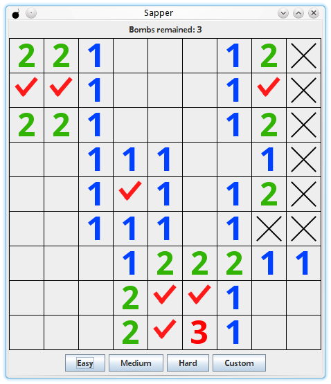

# Сапер

Мой вольный вариант программы **"Сапер"** из курса Петра Арсентьева
**"Java. Путь от ученика до эксперта"**.

Ссылка на сам курс: http://job4j.ru/courses/java_way_from_student_to_master.html

Для запуска (с учетом установленных JDK и maven) нужно ввести в директории проекта команду: `mvn compile exec:java`

Данная программа является аналогом стандартной игры **Windows Minesweeper**, в которой игроку предоставляется
нераскрытое поле с множеством клеток, каждая из которых может быть либо пустой, либо содержать мину. Общее количество
мин на поле известно. Игрок выбирает клетку, и если там мина, то он проигрывает, а если нет, то клетка открывается,
и ему отображается количество мин, расположенных вокруг нее. После того, как все пустые клетки открыты, игрок побеждает.

